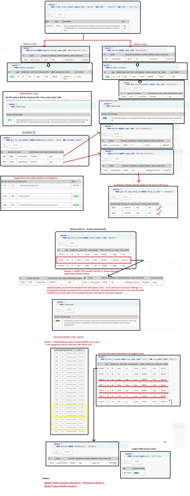

# sql-murder-mystery-solution
A walkthrough of the solution to **SQL Murder Mystery** by Northwestern University Knight Lab.  
Step-by-Step Solution documented by **Saitheja Komalla** 🕵️‍♂️

---

# 🕵️‍♂️ Murder Mystery SQL Challenge Solution

This repository contains my complete solution to the **SQL Murder Mystery Game**.  
I personally solved the mystery step by step using SQL queries to find out:

1. Who committed the murder  
2. Who was the real mastermind behind the crime  

---

## 📖 About the Challenge

The SQL Murder Mystery is an interactive puzzle where you solve a crime using SQL queries.  

- **Location of crime:** SQL City  
- **Goal:** Identify the murderer and the real mastermind  
- **Tools:** SQL database and logical investigation skills 🧠  
- **Official Challenge Website:** [SQL Murder Mystery](https://mystery.knightlab.com/)

---

## 🗂️ Repository Structure
sql-murder-mystery-solution/
│
├── README.md
├── Murder_mystery_solution.png   
└── LICENSE                        

## 🖼️ Step-by-Step Visual Solution

The **full visual solution** with a detailed step-by-step explanation is available here:

---

## 💻 Step-by-Step SQL Queries

Below are all the SQL queries used in my investigation:

### 1️⃣ Investigate Crime Scene

---

## 🖼️ Step-by-Step Visual Solution

My **full investigation** with all the reasoning and steps can be seen in the image below:

---

## 💻 My Investigation Process (With Queries in Text Form)

Below is the **step-by-step explanation** of how I solved the SQL Murder Mystery with the **queries written as plain text**:

---

### 1️⃣ Investigating the Crime Scene

I started by checking the **crime scene report** for a **murder** on **2018-01-15** in **SQL City**.

Query I used (as text):  
**Select * from crime_scene_report where type = 'murder', date = '20180115', and city = 'SQL City'.**

This gave me the crime details and mentioned **two witnesses**:
- One lived on **Northwestern Dr**  
- The other on **Franklin Ave**

---

### 2️⃣ Collecting Witness Information

**Witness 1:**  
I searched for people living on **Northwestern Dr**.  
Text query:  
**Select * from person where address_street_name like 'Northwestern Dr%'.**

Then I also checked their **drivers_license** info:  
**Select * from drivers_license.**

**Witness 2:**  
I looked for a person named **Annabel** (from the crime description).  
Text query:  
**Select * from person where name like 'Annabel%'.**

And again, I checked the **drivers_license** table for details:  
**Select * from drivers_license.**

---

### 3️⃣ Checking Witness Statements

I checked the **interview table** for both witnesses to see what they said:  
**Select * from interview.**

Key information I got:  
- **Witness 1** saw a man with a **Get Fit Now Gym bag**, partial plate **H42W**  
- **Witness 2** saw him at the **gym on January 9**

---

### 4️⃣ Identifying Possible Suspects

Since the suspect had a **Gold Gym membership**, I searched for:  
**Select * from get_fit_now_member where membership_status = 'gold' and id like '48Z%'.**

I found two suspects:  
- Joe Germuska  
- Jeremy Bowers

Then I checked their info:  
**Select * from person where name like 'Joe Germuska%'.**  
**Select * from person where name like 'Jeremy Bowers%'.**

---

### 5️⃣ Verifying the Alibi

Witness 2 said the suspect was at the gym on **2018-01-09**,  
so I checked the **check-in table**:  
**Select * from get_fit_now_check_in where check_in_date = '20180109'.**

Then I matched the **car plate** with the clue H42W:  
**Select * from drivers_license where plate_number like '%H42W%'.**

This confirmed that **Jeremy Bowers** was the **murderer**.  
I submitted him to the solution table:  
**Insert into solution values (1, 'Jeremy Bowers').**  
**Select value from solution.**

---

### 6️⃣ Finding the Real Mastermind

After submitting Jeremy Bowers, I read his **interview**:  
He revealed there was a **real mastermind** behind the crime.

Steps I followed:

1. Checked **Facebook event check-ins** for the **SQL Symphony Concert in December 2017**  
   **Select * from facebook_event_checkin where event_name = 'SQL Symphony Concert' and date like '201712%'.**

2. Focused on **Tesla Model S owners** matching **height and hair color** from the driver license data:  
   **Select * from drivers_license where car_make like 'Tesla' and car_model like 'Model S'.**

3. Found a match for **Miranda Priestly** using her **license ID 202298**:  
   **Select * from person where license_id = '202298'.**

4. Verified her **income** to confirm she had the resources to plan the crime:  
   **Select * from income where ssn = '987756388'.**

Final submission:  
**Insert into solution values (1, 'Miranda Priestly').**  
**Select value from solution.**

---

## 🏆 Final Outcome

- **Murderer:** Jeremy Bowers  
- **Mastermind:** Miranda Priestly  

Mystery Solved ✅

---

## 🚀 How to Use This Repository

1. Clone the repository:  
   git clone https://github.com/Saitheja20sql-murder-mystery-solution.git
   cd sql-murder-mystery-solution
